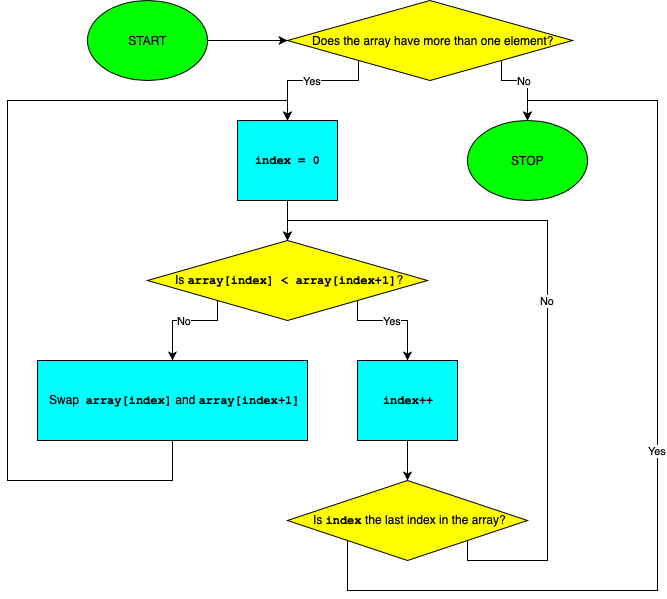
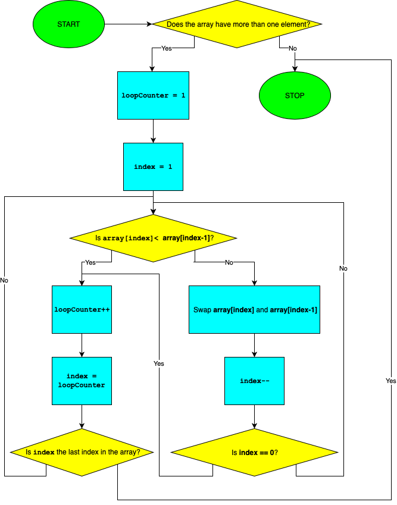

## Note – More Sorting Routines

**Gnome Sort**

```
Let the index be 0
Do the following until index+1 is beyond the length of the array:
    If the element at the index is greater than the one after it:
        Swap them
        Let index = 0
    Otherwise:
        Increase the index by 1
```

The idea is that you have a garden gnome sitting at the first element in the array. The gnome looks at the next element and sees whether it is smaller than the one it is sitting at. If it is, it swaps them and goes back to the beginning; if it isn't it moves along and sits at the next element. It repeats this process until it is sitting at the last element in the array. Gnome Sort was originally named "Stupid Sort" due to it performing far more comparisons than actually needed.

Here is a flowchart for the Gnome Sort algorithm.



**Shaker Sort**

```
Let the index be 0
Do the following until the array is sorted:
    Do the following until the index+1 is beyond the length of the array:
        If the element at the index is greater than the one after it:
            Swap them
        Increase the index by 1
    Do the following until the index reaches 1:
        If the element at the index is less than the one before it:
            Swap them
        Decrease the index by 1
```

Shaker Sort is Bubble Sort with a twist. Once the bubble reaches the end of the array, it heads backwards until it reaches the start of the array. It keeps heading forwards and backwards until the array is sorted.

**Insertion Sort**

```
Let the index be 1
Do the following until the index is beyond the length of the array:
    Look at the element at the index
    Do the following until that element is greater than the one before it:
        Swap the element with the one before it
    Increase the index by 1
```

The idea is that after `n` iterations, the first `n` elements are sorted by inserting the last one into its correct place. The process continues until all the elements are sorted. 

Rather than swapping adjacent elements, another option is to directly insert the element into its correct place and move the ones after it forwards one spot.

Here is a flowchart for the Insertion Sort algorithm:



**Shell Sort**

```
Let gap be half of the length of the array
Let index = 0
Do the following until the array is sorted:
    Do the following until index+gap is beyond the length of the array:
        Sort the elements at the following indices using bubble sort:
            index
            index+gap
            index+gap+gap
            etc.
        Increase index by 1
    Decrease the gap by a factor of 2 (i.e. divide it by 2)
```

Shell Sort is named after someone whose last name is Shell. It has nothing to do with seashells, nor the gas station, Shell.

The idea is that you split the array based on elements that are a certain gap apart. The elements that are the same gap apart are sorted, then the gap gets smaller and you repeat the process until the gap is less than 1. The gap starts at half the length of the array, then decreases by a factor of 2 every time.

**Comb Sort**

```
Let gap be the length of the array divided by 1.3 (rounded down)
Let index = 0
Do the following until the array is sorted:
    Do the following until index+gap is beyond the length of the array:
        Sort the elements at the following indices using bubble sort:
            index
            index+gap
            index+gap+gap
            etc.
        Increase index by 1
    Decrease the gap by a factor of 1.3 (i.e. divide it by 1.3)
```

Comb Sort is the same as Shell Sort, except the gap starts at the length of the array divided by 1.3 and it decreases by a factor of 1.3 every time. The value 1.3 is supposedly the one of the ideal gap sizes, which minimizes the number of swaps necessary.


**Bogo Sort**

```
Shuffle the array
Do the following until the array is sorted:
    If the array isn't sorted yet:
        Shuffle the array again
```

This is the true "Stupid Sort". Bogo Sort is intended to be a joke. It is impractical and is never guaranteed to terminate for long arrays. Never use it. Please.

All of the additional sorting algorithms here are classified as inefficient. As with **Bubble Sort** and **Selection Sort** they are relatively simple to understand, but they do more comparisons and/or swaps than necessary.


### Stability of Sorting Algorithms

The **stability** of a sorting algorithm refers to whether it preserves the order of duplicate elements. A sorting algorithm is **stable** if it preserves the order of duplicate elements, and **unstable** otherwise.

This may seem unimportant, but when an array consists of objects, it is often desirable to preserve the order of objects with the same key (the attribute that is being sorted).

| Stable Sorting Algorithms | Unstable Sorting Algorithms |
| --- | --- |
| <ul><li>Gnome Sort</li><li>Bubble Sort</li><li>Shaker Sort</li><li>Insertion Sort</li><li>Merge Sort</li></ul> | <ul><li>Selection Sort</li><li>Shell Sort</li><li>Comb Sort</li><li>Bogo Sort</li><li>Quick Sort</li></ul> |
